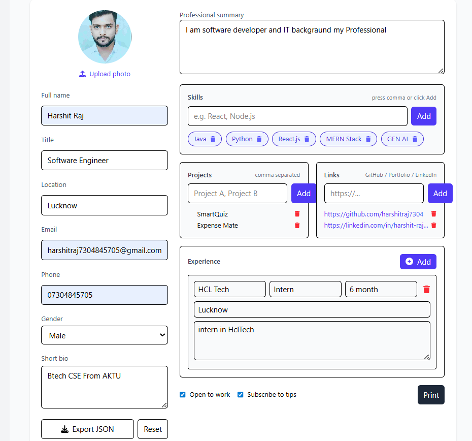
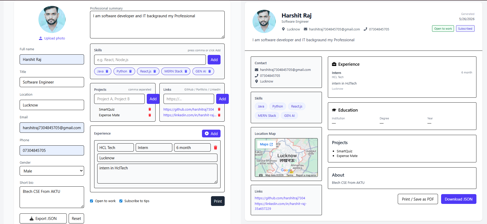

# 📄 Resume Generator

A professional Resume Generator web application built using **React JS**.  
This project allows users to create modern resumes dynamically with live preview and export functionality.

---

# 🚀 Features

- 📝 Dynamic resume form
- 👀 Live resume preview
- 📄 Professional resume layout
- 🖼 Upload profile image
- ➕ Add skills dynamically
- 💼 Add work experience
- 🔗 Add social/profile links
- 📍 Location & contact details
- 🖨 Print / Save as PDF
- 📥 Export resume data as JSON
- 📱 Fully responsive design

---

# 🛠 Tech Stack

- React JS
- JavaScript
- CSS
- HTML5

---

# 📸 Screenshots

## 📝 Resume Input Form



## 📄 Resume Output Page


## 👀 Resume Preview



---

# 📂 Folder Structure

```bash
src/
 ┣ components/
 ┣ pages/
 ┣ assets/
 ┣ App.jsx
 ┣ main.jsx
 ┗ index.css
```

---

# ⚙️ Installation & Setup

Clone the repository

```bash
git clone https://github.com/harshitraj7304/resume-generator.git
```

Go to project folder

```bash
cd resume-generator
```

Install dependencies

```bash
npm install
```

Start development server

```bash
npm run dev
```

---

# 🌐 Live Demo

```bash
Coming Soon...
```

(Add Netlify/Vercel link later)

---

# 📌 Future Improvements

- 🌙 Dark Mode
- 📄 Multiple Resume Templates
- ☁ Cloud Save Feature
- 🔐 Authentication System
- 📱 Better Mobile Optimization

---

# 👨‍💻 Author

**Harshit Raj**

- GitHub: https://github.com/harshitraj7304
- LinkedIn: https://linkedin.com/in/harshit-raj-35a657229

---

# ⭐ Support

If you like this project, give it a ⭐ on GitHub.
